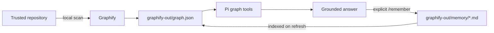

# Second Brain for Pi

[](https://github.com/solodev1911/second-brain-pi/actions/workflows/ci.yml)
[](LICENSE)

Local, explicit-save, source-linked project memory for [Pi](https://github.com/earendil-works/pi).

Second Brain turns each trusted repository into a private knowledge graph. Pi can use that graph to understand architecture, trace relationships, and recall conclusions you explicitly saved in earlier sessions. The graph and memories stay inside the repository; no hosted database or vector store is required.

> **Beta:** Second Brain is ready for early adopters. macOS is the primary verified platform, Linux is covered by CI, and Windows support is experimental. Please [report installation problems](https://github.com/solodev1911/second-brain-pi/issues/new?template=bug.yml).

## Install

Install these prerequisites once:

- [Pi](https://github.com/earendil-works/pi) `0.85.1` or newer
- Node.js `22.19` or newer
- [`uv`](https://docs.astral.sh/uv/getting-started/installation/)

Install the current public beta globally for Pi from GitHub:

```sh
pi install git:github.com/solodev1911/second-brain-pi
```

There is no per-repository installation and no separate Python or Graphify setup. On the first Pi launch, `uv` creates the package's isolated, locked Graphify environment. That first launch needs internet access and can take a few minutes; later launches reuse the environment.

The npm package is prepared but not published yet. Once the beta appears on
npm, the shorter versioned install will be:

```sh
pi install npm:@solodev1911/second-brain@beta
```

After the first stable npm release, `pi install npm:@solodev1911/second-brain`
will install the stable channel.

## Quick start

Open a repository and start Pi:

```sh
cd your-project
pi --approve
```

Then run:

```text
/second-brain-doctor
/graph-refresh
```

Ask Pi a question about the repository. When it gives an answer worth keeping, enter:

```text
/remember
```

Start a fresh Pi session and ask a related question. Pi can now retrieve the saved conclusion alongside the current source graph—and it is instructed to verify memories against current files before acting.

## Why explicit-save memory?

Agent memory is useful only when you can predict what becomes durable. Second Brain therefore has one save boundary: `/remember`.

- It never saves every conversation automatically.
- `/remember` captures only the latest completed answer on the active branch.
- Running, failed, aborted, and tool-pending answers are rejected.
- Exact duplicates reuse the existing memory record.
- Saved conclusions link back to their source graph nodes when possible.
- Current source wins when an old memory and the repository disagree.

## Commands

| Command | Purpose |
|---|---|
| `/second-brain-doctor` | Check Pi trust, `uv`, the Graphify runtime, project paths, and graph health. |
| `/graph-refresh` | Rebuild the current repository's graph and index saved memories. |
| `/memory-status` | Show the resolved project, engine, graph, memory directory, and last capture. |
| `/remember` | Save the latest settled answer after explicit approval. Accepts no arguments. |

Second Brain also exposes bounded graph tools to Pi:

| Tool | Purpose |
|---|---|
| `query_graph` | Search architecture, dependencies, data flow, and saved conclusions. |
| `get_node` | Inspect an exact graph node. |
| `get_neighbors` | Inspect a node's direct relationships. |
| `get_community` | Explore a detected graph community. |
| `god_nodes` | List highly connected concepts. |
| `graph_stats` | Read graph size and confidence statistics. |
| `shortest_path` | Find a bounded directed path between concepts. |
| `refresh_graph` | Refresh the project graph programmatically. |

## How it works



The Pi extension resolves the current trusted Git root, launches the bundled Graphify runtime over owned stdio MCP, and activates only the capabilities the runtime reports. Every repository has an isolated `graphify-out/` directory. Project-root and executable fields are injected by the host rather than exposed as model-controlled arguments.

No embeddings or vector database are introduced.

## Data and privacy

Second Brain has no telemetry and does not provide a hosted service.

- Source graph: `graphify-out/graph.json`
- Human-readable graph: `graphify-out/graph.html`
- Explicit memories: `graphify-out/memory/*.md`
- Local cache and supporting output: `graphify-out/`

Graph construction and storage are local. Pi may send ordinary prompts, selected source, graph results, and the answer being distilled to whichever model provider you configured in Pi. Second Brain never reads or manages that provider's credentials.

`graphify-out/` can contain source-derived names, relationships, and saved conversation content. Keep it ignored for private work unless you deliberately want to commit it. To erase a repository's Second Brain data, close Pi and delete that repository's `graphify-out/` directory.

Pi extensions run with your user account's permissions. Install only versions you trust, approve only repositories you trust, and review generated memories before sharing them. See [Security](SECURITY.md) and [Troubleshooting](docs/troubleshooting.md).

## Configuration

The default setup should require no configuration. Advanced overrides can be placed in `<project>/.pi/second-brain.json`:

```json
{
  "schemaVersion": 1,
  "graphify": {
    "command": "/path/to/python",
    "args": ["-m", "graphify.serve"],
    "cwd": "/path/to/graphify"
  },
  "startupRefresh": "off"
}
```

Machine-specific configuration should remain uncommitted. The equivalent environment variables are:

- `SECOND_BRAIN_GRAPHIFY_COMMAND`
- `SECOND_BRAIN_GRAPHIFY_ENGINE_ROOT`
- `SECOND_BRAIN_PROJECT_ROOT`
- `SECOND_BRAIN_STARTUP_REFRESH` (`background` or `off`)

Command-line flags take precedence over project configuration, which takes precedence over environment variables and automatic package discovery. An explicit project root must remain inside Pi's trusted working directory.

## Update or uninstall

Update a GitHub installation:

```sh
pi update git:github.com/solodev1911/second-brain-pi
```

Remove a GitHub installation:

```sh
pi remove git:github.com/solodev1911/second-brain-pi
```

After the npm beta is published, use
`pi update npm:@solodev1911/second-brain@beta` and
`pi remove npm:@solodev1911/second-brain` instead.

Uninstalling disables the extension but intentionally leaves every repository's `graphify-out/` data untouched. Delete those directories yourself if you also want to erase the graphs and memories.

## Limitations

- Large repositories can take time to index; use `/graph-refresh` deliberately if background refresh is disabled.
- Notebook (`.ipynb`) and binary scientific-data understanding is currently limited.
- Memory improves continuity but is not authoritative. The extension instructs Pi to verify current source.
- macOS is the best-tested platform. Linux is tested in CI; Windows remains experimental during beta.
- Compatibility is currently verified against Pi `0.85.1` and the bundled Graphify version documented in [Compatibility](docs/compatibility.md).

## Develop

```sh
git clone https://github.com/solodev1911/second-brain-pi.git
cd second-brain-pi
npm ci --legacy-peer-deps

cd graphify
uv sync --frozen --extra mcp
cd ..

npm run check
npm run pack:check
```

The real-model acceptance test is separate because it spends provider tokens. See [Verification](docs/verification.md) and [Contributing](CONTRIBUTING.md).

## Project status and credits

Second Brain is an independent community project for Pi. It vendors a patched [Graphify](https://github.com/Graphify-Labs/graphify) runtime to support project-scoped refresh and explicit memory indexing. Graphify is not affiliated with or maintained by this project.

See [Third-party notices](THIRD_PARTY_NOTICES.md) for attribution and [Changelog](CHANGELOG.md) for release history.

Licensed under the [Apache License 2.0](LICENSE).
